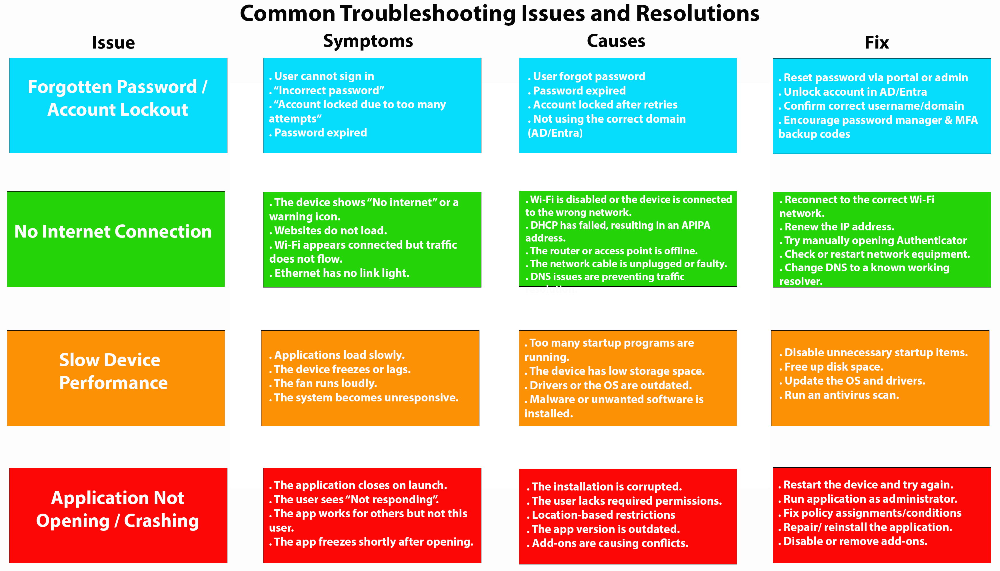
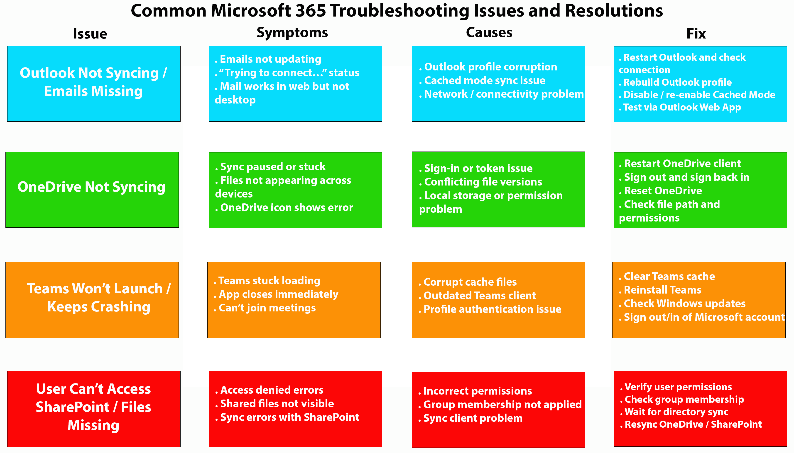
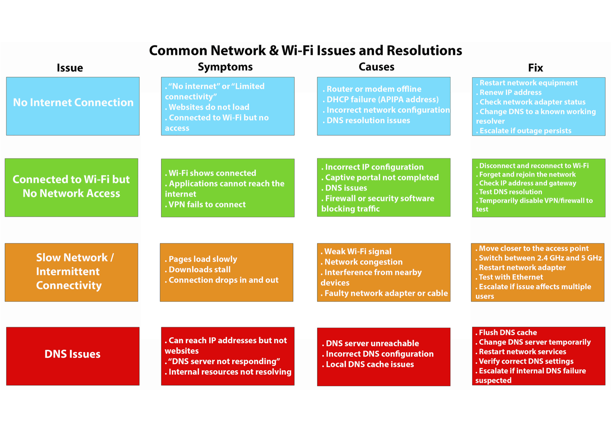
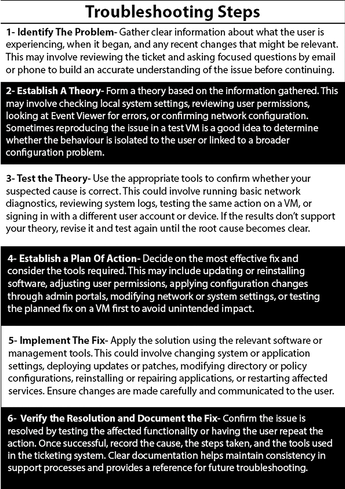

# Troubleshooting Playbooks

This repository contains practical troubleshooting reference material commonly used in IT support and junior infrastructure roles.  
The diagrams focus on identifying symptoms, likely causes, and structured resolution steps for common hardware, software, and network issues.

The content is designed to reflect real-world support workflows rather than theoretical explanations, and can be used as quick-reference material during incident investigation.

## Common Troubleshooting Issues

---

## Microsoft 365 Troubleshooting

## Hardware Troubleshooting

---

## Network & Wi-Fi Troubleshooting

---

## Troubleshooting Methodology

---

## Ticketing Systems & Incident Management

In real-world IT support environments, many of the issues outlined in these
troubleshooting playbooks are reported, tracked, and resolved through a
ticketing system.

This project demonstrates how common hardware, software, and network issues
can be documented, prioritised, and resolved within a structured support
workflow using Zendesk:

### [IT Support Case Management in Zendesk](https://github.com/kierannutt123/IT-Support-Case-Management-in-Zendesk/blob/main/IT-Support-Case-Management-in-Zendesk.md)

